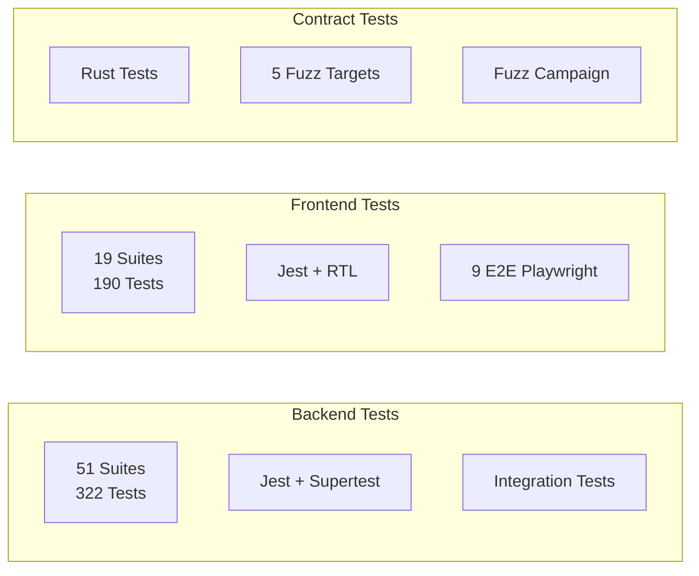

<div align="center">
  
  <br/><br/>

  **Turn remittance history into credit history**  

  [](https://opensource.org/licenses/ISC)
  [](https://github.com/Ziza-Lend/ZizaLend/actions/workflows/ci.yml)
  [](https://github.com/Ziza-Lend/ZizaLend/actions/workflows/codeql.yml)
  [](https://github.com/Ziza-Lend/ZizaLend/actions/workflows/deploy-staging.yml)
  <br/>
  [](https://nextjs.org/)
  [](https://expressjs.com/)
  [](https://soroban.stellar.org/)
  [](https://www.typescriptlang.org/)
  [](https://tailwindcss.com/)
  
  <br/>
  
  **[Architecture](ARCHITECTURE.md) • [Wiki](docs/wiki/README.md) • [Contributing](CONTRIBUTING.md) • [Security](SECURITY.md)**
</div>

---

## 📑 Table of Contents

- [Overview](#overview)
- [Key Features](#key-features)
- [System Architecture](#system-architecture)
- [Tech Stack](#tech-stack)
- [Quick Start](#quick-start)
- [Documentation](#documentation)
- [Testing](#testing)
- [Security](#security)
- [Contributing](#contributing)
- [Project Structure](#project-structure)
- [Project Stats](#project-stats)

---

## 🌍 Overview

Zizalend is a **decentralized lending protocol** on the Stellar network that transforms remittance history into credit history. Migrant workers — who are often invisible to traditional credit bureaus — can prove their financial reliability through consistent cross-border transfers, mint their creditworthiness as an NFT, and access fair loans from decentralized lending pools. Lenders earn transparent yield by providing liquidity to these pools.


---

## ✨ Key Features

### 🏃 For Borrowers

| Feature | Description |
|---------|-------------|
| **Credit Building** | Convert remittance history into an on-chain credit score (300–850) |
| **NFT Identity** | Mint a Remittance NFT that serves as your portable credit identity |
| **Fair Rates** | Access loans with transparent, non-predatory interest rates tied to your score tier |
| **Score Tiers** | Progress through 5 tiers: Seed (15%) → Bronze → Silver → Gold → Platinum (5%) |
| **Self-Custody** | Maintain full control using any Stellar wallet (Freighter, Albedo) |
| **Loan Refinancing** | Adjust loan terms mid-cycle with refinancing support |
| **Loan Extensions** | Extend due dates with a transparent fee structure |
| **Real-time Notifications** | Get SSE-pushed updates on loan status changes via in-app, email, and SMS |

### 💰 For Lenders

| Feature | Description |
|---------|-------------|
| **Transparent Yield** | Earn interest by providing liquidity to audited lending pools |
| **Pool Health Metrics** | Real-time utilization rates, stability scores, and risk tiers |
| **Position Tracking** | Monitor deployed capital, accrued yield, and transaction statuses |
| **Yield Charts** | Interactive earnings visualization with timeframe toggles (1D, 1W, 1M) |
| **Emergency Withdrawal** | Exit hatch when pools are paused — always maintain access to funds |
| **Risk Assessment** | Make informed decisions based on verifiable on-chain remittance proofs |

### 🎮 Gamification & Engagement

| Feature | Description |
|---------|-------------|
| **Kingdom Dashboard** | Map financial growth to a city-building experience with Kingdom Value tracking |
| **XP & Achievements** | Earn XP through financial actions — lending, repaying, maintaining positions |
| **Quest System** | "Whale Migration" (deploy liquidity), "Iron Resolve" (maintain position), and more |
| **Level Progression** | Track Archon level with direct quest-to-action integration |
| **NFT Achievement Stamps** | Earn "Early Adopter" and "Trusted" stamps on your Digital Passport |

---

## 🏗 System Architecture

```
┌─────────────────────────────────────────────────────────────────┐
│                      Users (Browsers/Wallets)                    │
└────────────────┬────────────────────────────────┬────────────────┘
                 │                                │
    ┌────────────▼──────────┐      ┌──────────────▼──────────────┐
    │   Next.js Frontend    │      │    Express.js Backend API   │
    │   • React 19          │      │    • Credit Scoring         │
    │   • Tailwind CSS 4    │      │    • Event Indexer          │
    │   • Freighter/Albedo  │◄────►│    • Webhook Delivery       │
    │   • i18n (EN/ES/TL)   │      │    • Notification Service   │
    │   • PWA Support       │      │    • Swagger/OpenAPI        │
    └────────────┬──────────┘      └──────────────┬──────────────┘
                 │                                │
                 │        ┌───────────────────────▼────────┐
                 │        │      PostgreSQL + Redis          │
                 │        │   (Metadata, Cache, Sessions)    │
                 │        └───────────────────────┬────────┘
                 │                                │
    ┌────────────▼────────────────────────────────▼────────────┐
    │                 Stellar Network (Soroban)                  │
    │                                                           │
    │  ┌──────────────┐  ┌──────────────┐  ┌────────────────┐  │
    │  │ RemittanceNFT │  │ Loan Manager │  │ Lending Pool   │  │
    │  │ • Credit      │◄►│ • Lifecycle  │◄►│ • Deposits     │  │
    │  │ • Scores      │  │ • Approvals  │  │ • Withdrawals  │  │
    │  │ • Collateral  │  │ • Repayments │  │ • Yield        │  │
    │  └──────────────┘  └──────┬───────┘  └────────────────┘  │
    │                           │                               │
    │                    ┌──────▼───────┐                        │
    │                    │Multisig Gov  │                        │
    │                    │• Proposals   │                        │
    │                    │• Timelock    │                        │
    │                    │• Admin       │                        │
    │                    └──────────────┘                        │
    └───────────────────────────────────────────────────────────┘
```

### 📦 Smart Contracts

Four Soroban (Rust) smart contracts power the protocol:

| Contract | Description | Key Functions | Events |
|----------|-------------|---------------|--------|
| **[RemittanceNFT](contracts/remittance_nft/)** | Credit identity & collateral | `mint`, `update_score`, `seize_collateral`, `transfer` | `Mint`, `ScoreUpd`, `Seized`, `Transfer` |
| **[LoanManager](contracts/loan_manager/)** | Full loan lifecycle | `request_loan`, `approve_loan`, `repay`, `liquidate`, `refinance`, `extend` | `LoanRequested`, `LoanApproved`, `LoanRepaid`, `LoanDefaulted` |
| **[LendingPool](contracts/lending_pool/)** | Liquidity management | `deposit`, `withdraw`, `emergency_withdraw`, `adjust_outstanding` | `Deposit`, `Withdraw`, `YieldDistributed` |
| **[MultisigGovernance](contracts/multisig_governance/)** | Admin with timelock | `propose_admin_transfer`, `approve_transfer`, `finalize`, `cancel` | `GovProp`, `GovAppr`, `GovFin`, `GovCncl` |

### ⚙️ Backend Services

| Service | Description |
|---------|-------------|
| **Event Indexer** | Polls Soroban RPC for contract events, persists to PostgreSQL, dispatches webhooks |
| **Credit Scoring** | Calculates and updates borrower credit scores based on repayment history |
| **Webhook Engine** | Delivers real-time events to subscribed URLs with HMAC signing and exponential backoff retry |
| **Notification Service** | Multi-channel notifications (in-app SSE, email via SendGrid, SMS via Twilio) with preferences |
| **SSE Streaming** | Real-time Server-Sent Events for live UI updates on loan status changes |
| **Score Reconciliation** | Periodic on-chain/off-chain score sync with optional auto-correction |
| **Default Checker** | Scheduled job to detect and process loan defaults |
| **Cache Layer** | Redis-backed caching for scores, pool data, and contract metadata |
| **Job Metrics** | Prometheus-compatible metrics for monitoring indexer health and job performance |
| **Rate Limiting** | Tiered rate limits per endpoint (anonymous, authenticated, admin) with Redis backend |
| **Role-Based Auth** | JWT authentication with RBAC (borrower, lender, admin roles) |

### 🎨 Frontend Features

| Page/Component | Description |
|----------------|-------------|
| **Landing / Wallet** | Wallet connection (Freighter, Albedo), session management |
| **Borrower Dashboard** | Credit score gauge, NFT status, active loans, repayment tracking |
| **Loan Wizard** | Step-by-step loan application (amount, collateral NFT, terms, signature) with refinance/extension modals |
| **Lender Dashboard** | Pool cards with utilization bars, risk badges, deposit/withdraw flows, yield charts |
| **Kingdom (Gamification)** | City-building experience, XP tracking, quest system, achievements panel |
| **Loan Details** | Timeline view, health status, repayment progress, collateral actions |
| **Notifications** | Real-time SSE notification stream, preferences, digest configuration |
| **Admin Panel** | Dispute management, governance controls, loan oversight |
| **Analytics** | Performance dashboards, transaction history, CSV exports |
| **Send Remittance** | Cross-border transfer interface with transaction preview |
| **Settings** | Notification preferences, wallet management, theme toggle |
| **Activity** | Full transaction history with filtering and search |

### 📘 TypeScript SDK (`@zizalend/types` & `packages/sdk`)

- Auto-generated TypeScript types from OpenAPI spec in `packages/types/`
- Typed HTTP client with JWT auth, retry logic, and error handling in `packages/sdk/`
- SDK sub-modules: `loans`, `notifications`, `scores`, `remittances`, `pools`, `auth`
- Server-to-server admin client with API key authentication

---

## 🛠 Tech Stack

### Frontend
| Technology | Purpose |
|------------|---------|
| **Next.js 16** | React framework with App Router, Server Components, Turbopack |
| **React 19** | UI library with new compiler, hooks, Suspense |
| **Tailwind CSS 4** | Utility-first styling with CSS-first configuration |
| **TypeScript 5** | Type safety across the entire codebase |
| **Stellar Wallet Kit** | Freighter, Albedo, and WalletConnect integration |
| **Framer Motion** | Animation library for micro-interactions |
| **Zustand** | Lightweight state management for stores |
| **React Query (TanStack)** | Server state management and caching |
| **next-intl** | Internationalization (English, Spanish, Tagalog) |
| **Recharts** | Charting for yield and performance dashboards |
| **Serwist** | PWA support with service workers |
| **Sentry** | Error tracking and performance monitoring |

### Backend
| Technology | Purpose |
|------------|---------|
| **Node.js 22** | JavaScript runtime |
| **Express.js 5** | HTTP framework with middleware pipeline |
| **TypeScript 5** | Type safety with strict mode |
| **PostgreSQL** | Primary database with connection pooling |
| **Redis** | Caching, rate limiting, session store |
| **Zod** | Runtime request validation with type inference |
| **node-pg-migrate** | Database migration framework |
| **Winston** | Structured logging with multiple transports |
| **Zod** | Request/response validation schemas |
| **Swagger / OpenAPI** | API documentation and SDK codegen |
| **JWT** | Stateless authentication |
| **Prometheus (prom-client)** | Metrics exposition for monitoring |
| **Sentry** | Error tracking and performance monitoring |
| **SendGrid** | Email delivery for notifications |
| **Twilio** | SMS delivery for notifications |

### Smart Contracts
| Technology | Purpose |
|------------|---------|
| **Rust** | Contract language with memory safety guarantees |
| **Soroban SDK** | Stellar's smart contract framework |
| **WASM** | WebAssembly compilation target |
| **Cargo** | Build system and dependency management |
| **Cargo Fuzz** | Property-based fuzz testing with 5 fuzz targets |
| **Soroban CLI** | Contract deployment and management |

### Infrastructure
| Technology | Purpose |
|------------|---------|
| **Docker & Compose** | Local development and staging deployment |
| **GitHub Actions** | CI/CD with 9 job types (CI, CodeQL, Dependency Review, Deploy) |
| **GHCR** | Container registry for staging images |
| **Sentry** | Error tracking across frontend and backend |
| **Trivy** | Vulnerability scanning in CI/CD pipeline |
| **Vercel** | Frontend hosting (planned) |

---

## 🚀 Quick Start

### Prerequisites

```bash
node -v        # See `.nvmrc` (Node 18)
nvm use        # or: nvm install
npm i -g pnpm  # if not installed
docker --version
rustup target add wasm32-unknown-unknown
```

### Docker (Recommended)

```bash
git clone https://github.com/Ziza-Lend/ZizaLend.git
cd ZizaLend

cp backend/.env.example backend/.env

docker compose up --build
```

| Service | URL |
|---------|-----|
| Frontend | http://localhost:3000 |
| Backend API | http://localhost:3001 |
| API Docs (Swagger) | http://localhost:3001/docs |
| PostgreSQL | localhost:5432 |
| Redis | localhost:6380 (maps to container port 6379) |

### Manual Setup

<details>
<summary><b>Backend</b></summary>

```bash
cd backend
npm install
cp .env.example .env
# Edit .env with your DATABASE_URL
npm run migrate:up
npm run dev
```

**Available scripts:**

| Command | Description |
|---------|-------------|
| `npm run dev` | Start dev server with hot reload |
| `npm run build` | Compile TypeScript to dist/ |
| `npm start` | Run production build |
| `npm test` | Run 322+ tests across 51 test suites |
| `npm run lint` | ESLint check (0 errors, 0 warnings) |
| `npm run typecheck` | TypeScript type checking |
| `npm run format` | Prettier formatting |
| `npm run migrate:up` | Apply database migrations |
| `npm run migrate:down` | Roll back migrations |
| `npm run seed` | Seed development data (`seed:dev`, `seed:reset` also available) |
</details>

<details>
<summary><b>Frontend</b></summary>

```bash
cd frontend
npm install
npm run dev
```

**Available scripts:**

| Command | Description |
|---------|-------------|
| `npm run dev` | Start dev server with Turbopack |
| `npm run build` | Production build (Next.js) |
| `npm start` | Run production build |
| `npm test` | Run 190+ unit tests |
| `npm run lint` | Prettier code style check |
| `npm run typecheck` | TypeScript type checking |
| `npm run test:e2e` | Playwright E2E tests (9 test files) |
</details>

<details>
<summary><b>Smart Contracts</b></summary>

```bash
cd contracts
cargo build --target wasm32-unknown-unknown --release
cargo test
```

**Fuzz testing:**

```bash
cd contracts/fuzz
cargo fuzz run lending_pool_fuzz
cargo fuzz run loan_manager_fuzz
cargo fuzz run remittance_nft_fuzz
cargo fuzz run multisig_governance_fuzz
```
</details>

---

## 📚 Documentation

| Resource | Description |
|----------|-------------|
| **[Architecture](ARCHITECTURE.md)** | Detailed system architecture with diagrams, data flow, security model |
| **[docs/wiki/](docs/wiki/README.md)** | Technical wiki — contract state machine, indexer sync, frontend patterns |
| **[docs/adr/](docs/adr/)** | Architecture Decision Records (smart contracts, event indexer, auth) |
| **[docs/ENVIRONMENT.md](docs/ENVIRONMENT.md)** | Complete environment variable reference for all packages |
| **[docs/webhooks.md](docs/webhooks.md)** | Webhook integration guide with HMAC signature verification |
| **[docs/deployed-contracts.md](docs/deployed-contracts.md)** | Deployed contract IDs on testnet/mainnet |
| **[docs/contracts-ACCESS-CONTROL.md](docs/contracts-ACCESS-CONTROL.md)** | Permission matrix for all 4 contracts |
| **[docs/runbooks/](docs/runbooks/)** | Operational runbooks (indexer recovery, troubleshooting) |
| **[Design Documents](LENDERS_DASHBOARD_DESIGN.md)** | Lenders dashboard UX design with color palette, component specs |
| **[UI/UX Mobile First](UIUX%20Mobile%20First.txt)** | Mobile-first design philosophy with gamification specs |
| **[Swagger UI](http://localhost:3001/docs)** | Interactive API documentation (dev only) |

### API Reference

The backend exposes an interactive Swagger UI for exploring and testing API endpoints:

- **Swagger UI**: http://localhost:3001/docs (dev/staging only)
- **OpenAPI JSON**: http://localhost:3001/docs.json

**Key API Endpoints:**

| Endpoint | Description |
|----------|-------------|
| `GET /health` | Health check with dependency status |
| `GET /health/deep` | Deep health check including indexer lag |
| `GET /api/score/:userId` | Get user credit score with band |
| `POST /api/score/update` | Update score from repayment event |
| `GET /api/score/:userId/breakdown` | Detailed score breakdown with transaction history |
| `POST /api/loans` | Request a new loan |
| `GET /api/loans` | List loans with filters |
| `POST /api/loans/:id/repay` | Make a loan repayment |
| `POST /api/pool/deposit` | Deposit into lending pool |
| `POST /api/pool/withdraw` | Withdraw from lending pool |
| `GET /api/events/stream` | SSE stream for real-time events |
| `POST /api/webhooks/subscribe` | Register a webhook subscription |
| `GET /api/notifications` | List user notifications with filters |
| `POST /api/auth/challenge` | Start wallet authentication |
| `POST /api/auth/verify` | Verify wallet signature and get JWT |

---

## 🧪 Testing



```bash
# Backend (322 tests)
cd backend && npm test

# Frontend (190 unit + 9 E2E)
cd frontend && npm test
cd frontend && npm run test:e2e

# Contracts (Rust)
cd contracts && cargo test
cd contracts/fuzz && cargo fuzz run lending_pool_fuzz
```

**Fuzz Testing:** The project maintains 5 property-based fuzz targets covering all 4 contracts, with automated campaign scripts and invariant documentation. See [`contracts/fuzz/`](contracts/fuzz/) and [`FUZZING_README.md`](FUZZING_README.md).

---

## 🔒 Security

### Security Architecture

ZizaLend implements defense-in-depth across 5 security layers:

| Layer | Protections |
|-------|-------------|
| **User** | Wallet custody (private keys never stored), hardware wallet support, session management |
| **Application** | Zod validation, rate limiting (tiered per endpoint), CORS whitelist, CSP headers, CSRF tokens |
| **Smart Contract** | Access control matrix, CEI (Checks-Effects-Interactions) pattern, integer overflow protection, reentrancy guards |
| **Network** | TLS/HTTPS, Stellar BFT consensus, transaction signing |
| **Monitoring** | Sentry error tracking, audit logging, security scanning (CodeQL, Trivy, Dependency Review) |

### Smart Contract Security

- **Access Control**: Every public function has explicit `require_auth()` checks. Admin functions are gated by stored admin address. Minter operations are limited to an `AuthorizedMinter` set (max 32).
- **CEI Pattern**: All state mutations are committed before any cross-contract token transfers — preventing reentrancy attacks.
- **Integer Safety**: All arithmetic uses `checked_mul`, `checked_div`, `checked_add` chains with hard caps (`MAX_RATIO_BPS = 10_000`, `MAX_PENALTY_MULTIPLIER = 2`).
- **Governance Timelock**: Admin transfers require a multisig proposal with 24-hour minimum timelock, 1-hour reproposal cooldown, and 7-day proposal expiry.

### CI/CD Security

- **Supply Chain**: Blocked packages (plain-crypto-js), axios 1.14.x blocked after known compromise
- **Vulnerability Scanning**: Trivy scans every staging image (HIGH=warn, CRITICAL=fail)
- **Code Analysis**: CodeQL and ESLint run on every PR
- **Dependency Review**: Automatic review of dependency changes
- **Commit Linting**: Conventional Commits enforced with commitlint

---

## 🤝 Contributing

We welcome contributions! See [CONTRIBUTING.md](CONTRIBUTING.md) for detailed guidelines.

### Quick Start for Contributors

1. Fork the repository
2. Create a feature branch (`git checkout -b feat/amazing-feature`)
3. Make changes and commit using [Conventional Commits](https://www.conventionalcommits.org/)
4. Push and open a Pull Request

### Good First Issues

Check out our [good first issues](https://github.com/Ziza-Lend/ZizaLend/issues?q=is%3Aissue+is%3Aopen+label%3A%22good+first+issue%22) for beginner-friendly tasks across frontend, backend, and contracts. Detailed issue descriptions are maintained at [`docs/contributor-issues/`](docs/contributor-issues/).

### Branch Naming

| Prefix | Purpose |
|--------|---------|
| `feat/` | New features |
| `fix/` | Bug fixes |
| `docs/` | Documentation |
| `refactor/` | Refactoring |
| `perf/` | Performance |
| `chore/` | Maintenance |

---

## 📋 Project Structure

```
ZizaLend/
├── backend/                  # Express.js API (Node 22, TypeScript)
│   ├── src/
│   │   ├── controllers/      # Route handlers (13 controllers)
│   │   ├── services/         # Business logic (16 services)
│   │   ├── middleware/       # Auth, rate limiting, validation
│   │   ├── schemas/          # Zod validation schemas
│   │   ├── config/           # Environment configuration
│   │   ├── routes/           # Express route definitions
│   │   ├── errors/           # Custom error classes
│   │   ├── cron/             # Scheduled jobs
│   │   ├── auth/             # RBAC definitions
│   │   ├── db/               # Database connection & transactions
│   │   └── utils/            # Utilities (logger, cache, pagination)
│   ├── migrations/           # DB migration files (27 migrations)
│   └── tests/                # Integration tests
├── frontend/                 # Next.js 16 app (React 19)
│   ├── src/
│   │   ├── app/              # Next.js App Router pages
│   │   ├── components/       # React components (UI, loan, wallet, gamification)
│   │   ├── hooks/            # Custom React hooks
│   │   ├── stores/           # Zustand state stores
│   │   └── utils/            # Utilities (Stellar, formatting, CSV)
│   └── e2e/                  # Playwright E2E tests
├── contracts/                # Soroban Rust smart contracts
│   ├── remittance_nft/       # Credit identity NFT contract
│   ├── loan_manager/         # Loan lifecycle contract
│   ├── lending_pool/         # Liquidity pool contract
│   ├── multisig_governance/  # Governance timelock contract
│   ├── fuzz/                 # Property-based fuzz testing
│   └── fuzz_targets/         # 5 fuzz targets
├── packages/
│   ├── types/                # Auto-generated TypeScript types from OpenAPI
│   └── sdk/                  # Typed API client SDK
├── scripts/                  # Deployment and utility scripts
├── docs/                     # Documentation, ADRs, wiki, runbooks
└── .github/                  # CI/CD workflows, issue templates
```

---

## 📊 Project Stats

| Metric | Count |
|--------|-------|
| Smart Contracts | 4 Soroban contracts |
| Backend Services | 19 services, 13 controllers, 11 middleware |
| API Endpoints | 50+ REST endpoints |
| Database Migrations | 27 migration files |
| Backend Tests | 51 suites, 322 tests |
| Frontend Tests | 19 suites, 190 unit tests, 9 E2E tests |
| Fuzz Targets | 5 property-based fuzz targets |
| CI Jobs | 6 job types (CI, CodeQL, Deploy Staging, Dependency Review, Commitlint, Load Test) |
| Languages | TypeScript, Rust, JavaScript, Solidity (planned) |

---

## 📄 License

This project is licensed under the ISC License. See the [LICENSE](LICENSE) file for details.

---

<div align="center">
  Built on <a href="https://stellar.org">Stellar</a> • Powered by <a href="https://soroban.stellar.org">Soroban</a>
  <br/><br/>
  <sub>Zizalend — Turning remittances into financial inclusion</sub>
</div>
